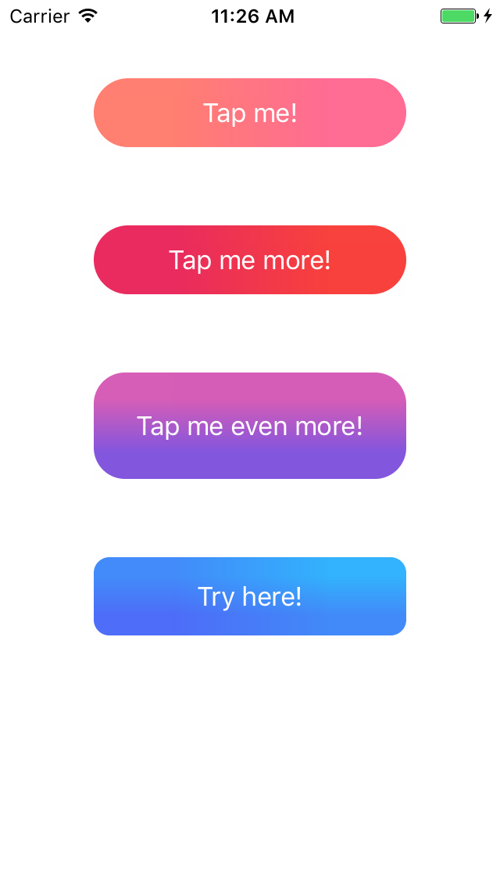

# DTGradientButton

[](http://cocoapods.org/pods/DTGradientButton)
[](http://cocoapods.org/pods/DTGradientButton)
[](http://cocoapods.org/pods/DTGradientButton)

## Screenshot

<br/>

## Example
To run the example project, clone the repo, and run `pod install` from the Example directory first.

## Usage
To set gradient colors as background for a button, just use it as below:

```swift
let colors = [UIColor(hex: "FF8960"), UIColor(hex: "FF62A5")]
button.setGradientBackgroundColors(colors, direction: .toRight, for: .normal)
```

Method ```setGradientBackgroundColors(_ colors:, direction:, for state:)``` is provided as an extended method of UIButton. For that reason, you can use it for any UIButton instance in your project. 

Eight predefined directions are supported for the gradient.

```swift
public enum DTImageGradientDirection {
    case toLeft
    case toRight
    case toTop
    case toBottom
    case toBottomLeft
    case toBottomRight
    case toTopLeft
    case toTopRight
}
```

Besides setting gradient background for UIButton, you can take advantage of this library to create gradient image as below:

```swift
let colors = [UIColor(hex: "FF8960"), UIColor(hex: "FF62A5")]
let image = UIImage(size: CGSize(width: 100, height: 100), direction: .toBottom, colors: colors)
```

## Requirements
### iOS 8.0

## Installation

### CocoaPods
Add the following line to your Podfile:

```ruby
pod 'DTGradientButton'
```

### Swift package manager
`DTGradientButton ` is available for SPM from version `0.1.3`.
Add the following to the dependencies of your `Package.swift`:

```swift
.package(url: "https://github.com/tungvoduc/DTGradientButton", from: "version")
```

## Author

Tung Vo, tung98.dn@gmail.com

## License

DTGradientButton is available under the MIT license. See the LICENSE file for more info.

## Feedbacks & requests
- Open an issue if you find a bug, make a proposal or simply need some help.
- You can also contact me via [email](mailto:tung98.dn@gmail.com).
